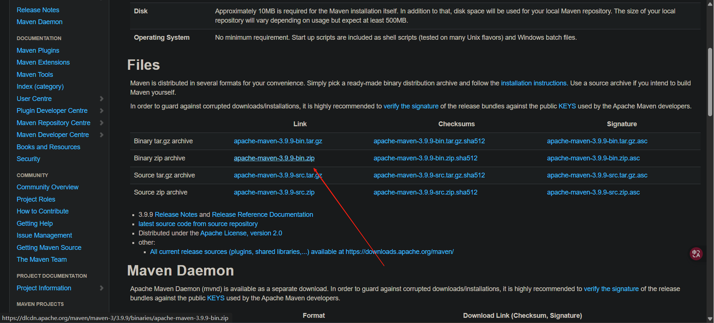
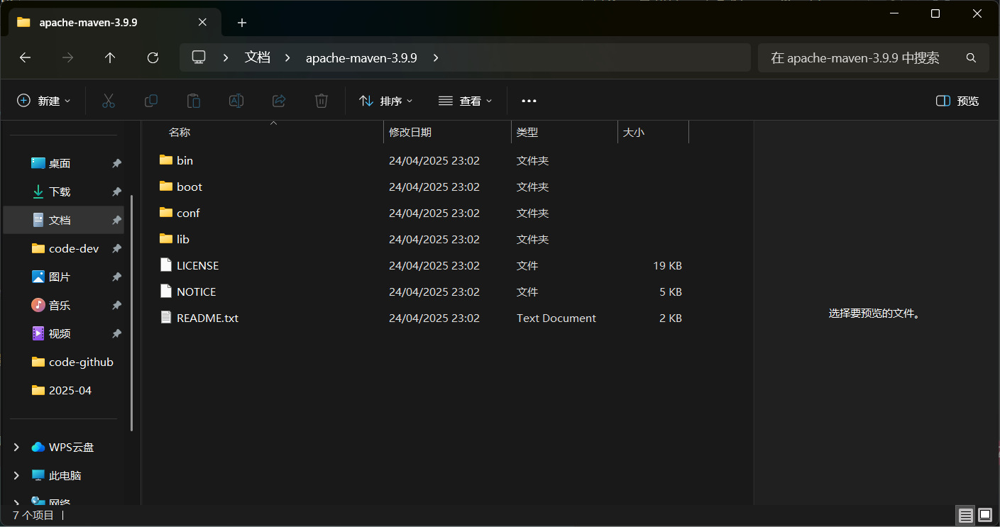
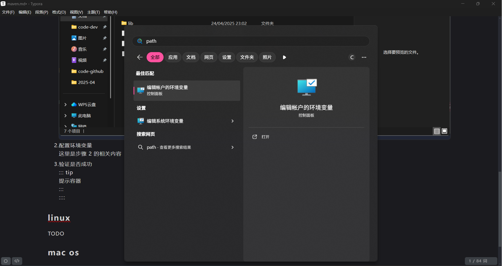
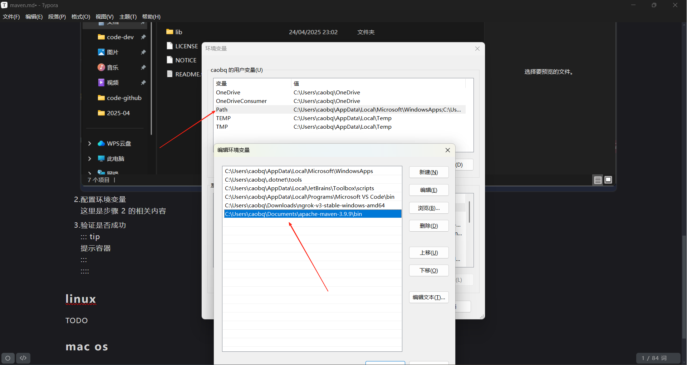
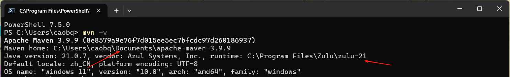

@[youtube start="0" end="0" width="100%" height="500px" ratio="16:9"](Xatr8AZLOsE)

## what`s maven

Maven 是一个基于 POM（Project Object Model）[+pom] 的强大项目管理工具是一个可用于构建和管理任何基于 Java 项目的工具
Maven 使 Java 开发人员的日常工作更轻松。

## why maven

## install maven

<LinkCard title="" href="https://maven.apache.org/install.html" description="how to install maven" />

::: tip 前置条件

- maven 需要 JDK 提供支持
- 对于当前稳定版本 3.9.9 需要 JDK 8+，但任何最新版本都可以正常工作
  :::

### windows

:::: steps

1. 下载 zip 文件并解压

   

   

2. 配置环境变量

   

   

3. 验证是否成功

   

   ::::

### linux

```shell
sdk install maven
```

### mac os

```shell
brew install maven
```

## quickstart


[+pom]:
   pom.xml 是一种基于 XML 格式的描述文件其中包含与项目本身有关的信息(开发者信息等）和用于配置项目的信息（项目的依赖项、源目录、插件、目标等）当执行 maven
   命令时 maven 通过读取 pom.xml 文件以完成其配置和操作因此当执行 maven 命令时需要为 maven 提供一个 POM 文件来执行命令。